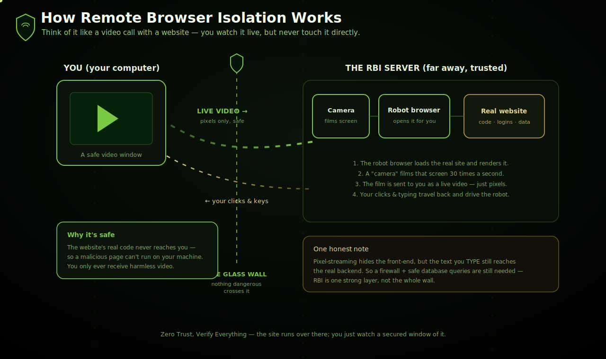
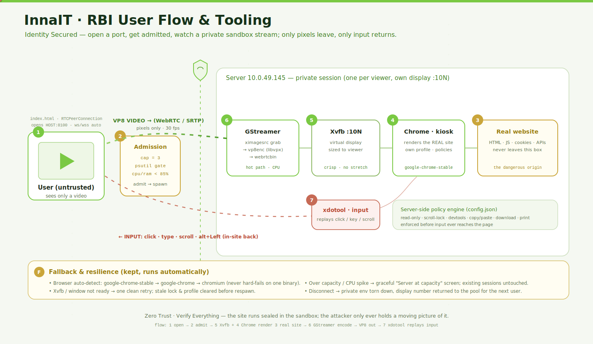
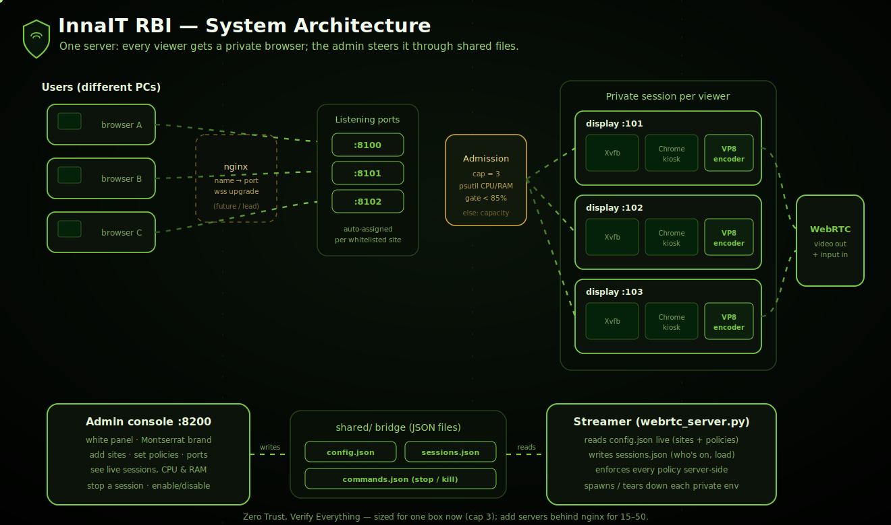
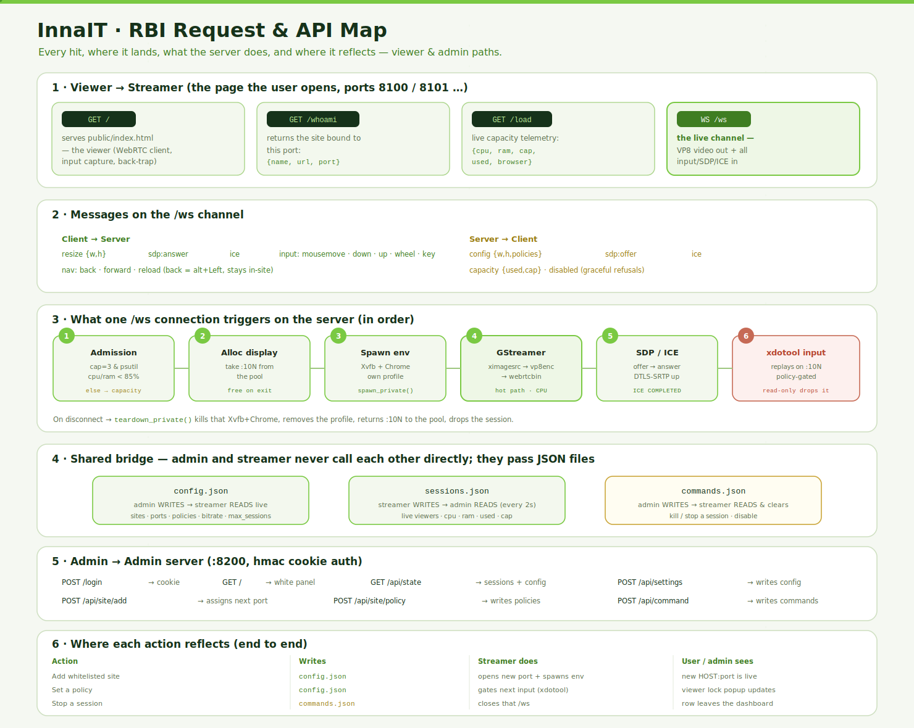

<div align="center">

# 🛡️ InnaIT — Remote Browser Isolation

### _Run the web at arm's length. Users see pixels, never code._

**Whitelisted sites run inside a server-side sandbox. Only a live video of the page reaches the user — every click, keystroke, and scroll is relayed back through a server-side policy gate.**

<br>


</div>


<div align="center">


---

## 📖 Table of Contents

- [What is this?](#-what-is-this)
- [How it works](#-how-it-works)
- [User flow](#-user-flow)
- [System architecture](#-system-architecture)
- [API & message map](#-api--message-map)
- [Resources & capacity](#-resources--capacity)
- [The seven policies](#-the-seven-policies)
- [Quick start](#-quick-start)
- [Scaling & honest limits](#-scaling--honest-limits)
- [Security notes](#-security-notes)

---

## 🌐 What is this?

InnaIT RBI is a **Remote Browser Isolation** platform. Instead of letting a user's browser load a website directly, the site is opened by a **sandbox browser on our server**, and only a **live video stream of the page** is sent to the user. The user interacts normally — clicking, typing, scrolling — but their device never touches the site's actual code.

> **Reverse isolation.** Classic RBI protects a *user* from a hostile *website*. This platform is built the other way around: it protects **our server and applications from untrusted users**. The user's device never receives page code, and our server internals are never exposed.

**Why it matters**

| | |
|---|---|
| 🧊 **Absolute isolation** | The device receives pixels only — no HTML, scripts, URLs, or internal IDs leak out. |
| 🎛️ **Server-side control** | Copy, paste, clipboard, DevTools, and right-click are enforced on the server — impossible to bypass from the client. |
| 💻 **Clientless** | Any device, any modern browser. Nothing to install. |
| ♻️ **Ephemeral** | Each user gets a fresh sandbox that is destroyed on disconnect — no residual state. |

---

## 🎥 How it works

Think of it like a **video call with a website** — you watch it live, but never touch it directly. A robot browser on the server opens the real site, a "camera" films the screen many times a second, and that film streams to you as harmless pixels. Your clicks and keystrokes travel back and drive the robot.

<div align="center">



</div>

**The mechanism, in three continuous parts:**

1. **Rendering (server → user).** The whitelisted site loads in the sandbox Chrome on a private virtual display. A GStreamer pipeline captures the display, encodes it as VP8 (re-encoding only regions that change, to save CPU when idle), and delivers it over WebRTC.
2. **Interaction (user → server).** The viewer captures mouse and keyboard events and sends them over a WebSocket. Each event passes the **policy gate** before being injected into the sandbox with `xdotool`.
3. **Policy enforcement.** A single server-side gate decides what every input may do. Because it runs on the server, it cannot be tampered with from the user's browser.

> 💡 **One honest note.** Pixel-streaming hides the front-end, but the text a user *types* still reaches the real backend. A firewall (WAF) and parameterized database queries are still required — **RBI is one strong layer, not the whole wall.**

---

## 👤 User flow

From the user's side it feels like an ordinary web page — the isolation is invisible.

<div align="center">



</div>

| Step | What happens |
|:---:|---|
| **1** | **Open viewer** — the browser loads the viewer page and opens a WebSocket. |
| **2** | **Session grant** — the server checks capacity; within cap, it spawns a private sandbox. |
| **3** | **Live stream** — the user sees the real site as VP8 video. |
| **4** | **Interact** — clicks, typing, scroll, copy/paste, right-click — all policy-checked. |
| **5** | **Disconnect** — the sandbox is torn down and the capacity slot is freed. |

---

## 🏗️ System architecture

One server runs two cooperating services that share state through JSON files, spawning **one isolated sandbox per active viewer**.

<div align="center">



</div>

**Components**

| Component | Role | Port |
|---|---|:---:|
| **WebRTC Streamer** | Spawns sandboxes, encodes VP8, relays input, enforces policy | `8100+` |
| **Admin Server** | Web console to manage sites & policies; writes config | `8200` |
| **Shared State** | `config.json` (sites/policies) · `sessions.json` (live sessions) | _files_ |
| **Session sandbox** | Per-user `Xvfb` + `openbox` + Chrome (`--app`) + encoder | `:101+` |

Each viewer connection creates a **dedicated environment**: a private virtual display, a minimal window manager to keep the browser borderless, a Chrome instance with its own profile, and a VP8 encoder sized to the viewer's window. On disconnect, everything is torn down and the display number returns to the pool — giving strong process-level isolation between users.

---

## 🔌 API & message map

The viewer talks to the streamer over **HTTP** (initial page) and **WebSocket** (signalling, input, clipboard). The admin console manages configuration over a small **HTTP API**. Streamer and admin communicate only through the shared JSON files.

<div align="center">



</div>

<details>
<summary><b>📡 Streamer — WebSocket messages</b></summary>

<br>

| Direction | Message | Purpose |
|---|---|---|
| client → server | `offer` / `ICE` | Establish the media connection |
| server → client | `answer` / `ICE` / `config` | Complete connection; send size, name, policies |
| server → client | `VP8 media` | The live pixel stream |
| client → server | `input` (key/mouse/wheel) | User interaction (policy-gated) |
| client → server | `copy` / `cut` / `paste` | Clipboard bridge |
| server → client | `clipdata` | Text copied inside → local clipboard |
| client → server | `nav` (back/forward/reload) | Navigation controls |
| server → client | `capacity` / `disabled` | Refusal or site-disabled notices |

</details>

<details>
<summary><b>🛠️ Admin — HTTP API</b></summary>

<br>

| Route | Purpose |
|---|---|
| `/login`, `/logout` | Admin authentication |
| `/api/state` | Current sites, policies, and live sessions |
| `/api/settings` | Global settings (bitrate, cap, host) |
| `/api/site/{add,delete,policy}` | Manage whitelisted sites and their policies |
| `/api/command` | Issue runtime commands to the streamer |
| `/load` _(streamer)_ | Live `{ cpu, ram, cap, used }` — for load balancing |

</details>

---

## 📊 Resources & capacity

Capacity is **CPU-bound** — the dominant cost per user is live video encoding. The server measures its own hardware, computes a safe concurrent cap, and refuses new sessions when live CPU or RAM exceed safe ceilings.

<div align="center">



</div>

**Per concurrent user**

```text
CPU        ~0.7 – 1.2 cores   ← live VP8 encode (the bottleneck)
RAM        ~0.4 – 0.6 GB      ← sandbox Chrome + profile
Bandwidth  ~3 – 6 Mbps        ← VP8 stream
```

**Concurrent users by approach**

| Approach | Concurrent users |
|---|:---:|
| This box (4 cores, CPU) | **3 – 4** |
| Tuned (22 fps + encode-on-change) | **5 – 8** |
| One GPU node (NVENC) | **20 – 40** |
| Multi-node fleet | **hundreds → thousands** |

> ⚙️ **Cap formula:** `min(cores − 1, (GB − 2) / 0.5)`, gated live at **85% CPU / 85% RAM**. Idle users cost little — the encoder only works when the screen changes.

---

## 🔐 The seven policies

A single server-side gate governs what every input is allowed to do. When a policy is **off**, that action is blocked.

| Policy | When off, blocks… |
|---|---|
| `read_only` | Clicks, typing, and selection _(scrolling still allowed)_ |
| `scroll_lock` | Mouse-wheel and keyboard scrolling |
| `copy` | Copy / cut / select-all (and copy-out to local clipboard) |
| `paste` | Paste (and paste-in from local clipboard) |
| `clipboard` | The site's JavaScript clipboard API |
| `devtools` | F12, Inspect, view-source, developer tools |
| `rightclick` | The right-click context menu |

> 📋 **Clipboard bridge.** When copy & paste are permitted, text crosses the isolation boundary safely: copying inside reads the server clipboard and hands it to the user's local clipboard; pasting sends the local clipboard back in. In-sandbox copy/paste works over plain HTTP; **copy-out to the local machine requires HTTPS** (a browser security rule).

---

## 🚀 Quick start

**Dependencies**

```bash
# System packages
xvfb  xdotool  xclip  x11-utils  openbox  wmctrl
gstreamer1.0-{tools,plugins-base,plugins-good,plugins-bad,plugins-ugly,nice}
python3-gi  python3-psutil
google-chrome-stable
```

**Install & run**

```bash
sudo ./install.sh                          # deps, Chrome, app, env, systemd services
systemctl status rbi-webrtc rbi-admin      # confirm services are up
curl -s http://localhost:8100/load         # → {cpu, ram, cap, used}
```

**Verify a healthy start** — the streamer log should show:

```text
WebRTC RBI (PRIVATE) up | browser=google-chrome-stable | cores=4 ram=11.7GB | cap=3 | psutil=yes
```

> 🧩 **Lesson from the build:** early failures (input relay, toolbar, right-click) traced to **missing system packages** on a hand-built server. The installer now provisions the full dependency set so a fresh node works on the first deployment.

---

## 📈 Scaling & honest limits

The platform is shaped for horizontal scaling — each node exposes `/load`, and a load balancer routes new users to the least-loaded node.

| Peak **concurrent** (active at once) | Feasible? | What it takes |
|---|:---:|---|
| Hundreds | ✅ Comfortably | A handful of nodes + broker |
| Low thousands | ✅ Yes | ~50–250 GPU nodes + load balancer |
| Lakhs **concurrent** | ❌ Not practical | Thousands of GPUs — hyperscaler scale |

> **"Users" vs "concurrent" is the key distinction.** The platform can *serve* lakhs of **registered** users — only the **active** ones consume resources. If lakhs are registered but a few hundred are active at peak, you build for the few hundred. **Only peak-concurrent drives capacity; the registered total is nearly irrelevant.**

Pixel-streaming is the most isolating method — and therefore the costliest per user. That is the accepted price of never leaking server internals.

---

## 🔒 Security notes

- **Two-layer model (recommended for production):** a self-hosted connection **broker** (Pomerium / Teleport) hides *where* the server is (no inbound open door — it dials out); the **pixel isolation** hides *what* it contains.
- **Application defenses remain mandatory:** WAF, input validation, rate-limiting, and parameterized queries. Isolation hides the server from view; it does not sanitize what users send through the permitted input channel.
- **Screen capture** by the user is inherent to any visual system; watermarking can deter but not prevent it.
- **Whitelist enforcement** should be active (block off-approved-domain navigation), not assumed.

---

<div align="center">

**InnaIT Remote Browser Isolation** · Precision Biometric

_Zero Trust, Verify Everything — the site runs over there; you just watch a secured window of it._

</div>
